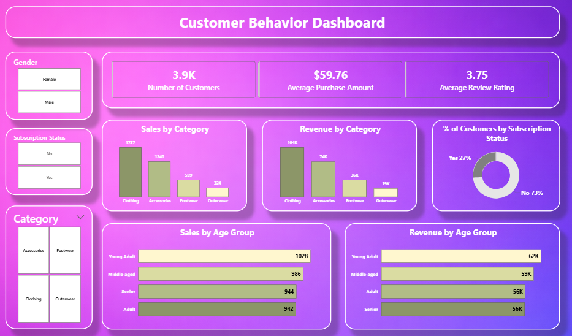

# Retail Customer Analytics

<h2>🛍️ Retail Customer Behavior Analytics Dashboard – Project Summary</h2>

A complete <b>end-to-end data analytics project</b> focused on analyzing customer shopping behavior in a retail business environment.

This project transforms raw transactional data into <b>actionable business insights</b> using <b>Python, SQL, and Power BI</b>, helping stakeholders understand customer segments, revenue drivers, and purchasing trends.

<h2>🎯 Business Objective</h2>

Retail businesses often struggle to answer:

<ul>
  <li>Which customers generate the most revenue?</li>
  <li>What product categories perform best?</li>
  <li>How does age and gender influence buying behavior?</li>
  <li>What role do subscriptions play in revenue growth?</li>
</ul>

This project answers these questions through <b>data-driven insights and interactive visualization</b>.

<h2>🧠 Key Insights</h2>

<ul>
  <li> Female customers contribute a significant share of total purchases</li>
  <li> Clothing category accounts for the highest performance with 1,737 sales (~45% of total sales) and 104K revenue (~45% of total revenue).</li>
  <li> Young Adults contribute the most with 1,028 purchases (~26%) and 62K revenue (~26%), making them the most valuable customer segment.</li>
  <li> Adult and Senior groups each contribute 56K revenue (~24% each), showing consistent spending across older demographics.</li>
  <li> Only ~27% customers are subscribed → growth opportunity</li>
</ul>

<b>👉 Translation (what recruiters care about):</b> 
You didn’t just analyze data — you identified <b>real business opportunities</b>.

<h2>📊 Dashboard Overview</h2>

<h3>🔹 Key Performance Indicators (KPIs)</h3>
<ul>
  <li><b>Total Customers:</b> 3.9K</li>
  <li><b>Average Purchase Amount:</b> $59.76</li>
  <li><b>Average Review Rating:</b> 3.75</li>
</ul>

<h3>🔹 Visual Insights</h3>
<ul>
  <li>Sales &amp; Revenue by Category</li>
  <li>Customer Distribution by Subscription</li>
  <li>Sales &amp; Revenue by Age Group</li>
  <li>Interactive Filters (Gender, Category, Subscription)</li>
</ul>

<h2>🖼️ Dashboard Preview</h2>

<h2>⚙️ Tech Stack</h2>

<table>
  <tr>
    <th>Layer</th>
    <th>Tools Used</th>
  </tr>
  <tr>
    <td>Data Cleaning</td>
    <td>Python (Pandas)</td>
  </tr>
  <tr>
    <td>Querying</td>
    <td>SQL</td>
  </tr>
  <tr>
    <td>Visualization</td>
    <td>Power BI</td>
  </tr>
  <tr>
    <td>Documentation</td>
    <td>Markdown</td>
  </tr>
</table>

<h2>🔄 Project Workflow</h2>

Raw Data → Data Cleaning → Exploratory Analysis → SQL Insights → Power BI Dashboard → Business Recommendations

<h2>📂 Project Structure</h2>

<pre>
📁 Retail-Customer-Analytics
│── 📁 data
│   └── customer_shopping_behavior.csv
│
│── 📁 notebooks
│   └── eda_analysis.ipynb
│
│── 📁 sql
│   └── business_analysis.sql
│
│── 📁 dashboard
│   └── customer_behavior_dashboard.pbix
│
│── 📁 images
│   └── dashboard_preview.png
│
│── README.md
</pre>

<h2>🧪 Key Analysis Performed</h2>

<h3>🔹 Python (EDA)</h3>
<ul>
  <li>Data cleaning &amp; preprocessing</li>
  <li>Missing value handling</li>
  <li>Distribution analysis</li>
  <li>Customer segmentation</li>
</ul>

<h3>🔹 SQL</h3>
<ul>
  <li>Revenue by gender</li>
  <li>Category-wise performance</li>
  <li>Age group analysis</li>
  <li>Subscription impact</li>
</ul>

<h3>🔹 Power BI</h3>
<ul>
  <li>KPI Cards</li>
  <li>Interactive filters</li>
  <li>Category comparison charts</li>
  <li>Demographic breakdown</li>
</ul>

<h2>🚀 How to Run the Project</h2>

<h2>🚀 How to Run the Project</h2>

<ol>
  <li>
    <b>Clone the repository</b>
    <pre>
git clone https://github.com/your-username/retail-customer-analytics.git
cd retail-customer-analytics
    </pre>
  </li>

  <li>
    <b>Open the Jupyter Notebook</b>
    
notebooks/eda_analysis.ipynb

    This notebook includes:
      Data Import
      Data Exploration (EDA)
      Data Cleaning & Preprocessing
      Feature Understanding

  </li>

  <li>
    <b>Set up SQL Database</b>
    <ul>
      <li>Create a database in MySQL / PostgreSQL / SQL Server</li>
      <li>Use the dataset: <code>data/customer_shopping_behavior.csv</code></li>
      <li>Load cleaned data into your SQL database</li>
    </ul>
  </li>

  <li>
    <b>Run SQL Analysis</b>
    
Open the file:

    <pre>sql/business_analysis.sql</pre>

    This file contains queries for:
      Revenue by gender
      Category-wise performance
      Age group analysis
      Subscription insights
    
  </li>

  <li>
    <b>Open Power BI Dashboard</b>
    
Navigate to:

    <pre>dashboard/customer_behavior_dashboard.pbix</pre>

    Connect Power BI to your SQL database
      Load the data model
      Explore interactive visuals and insights
   
  </li>

  <li>
    <b>Customize & Explore</b>
    <ul>
      <li>Modify queries for deeper insights</li>
      <li>Enhance dashboard visuals</li>
      <li>Experiment with filters and KPIs</li>
    </ul>
  </li>
</ol>

<h2>💡 Business Recommendations</h2>

<ul>
  <li> Increase subscription adoption using discounts or loyalty programs</li>
  <li> Target young adults with personalized marketing campaigns</li>
  <li> Focus inventory on high-performing categories (Clothing)</li>
  <li> Improve product quality to boost customer ratings</li>
</ul>

<h2>📌 Why This Project Stands Out</h2>

<ul>
  <li> End-to-end analytics pipeline (not just visualization)</li>
  <li> Combines Python + SQL + Power BI</li>
  <li> Focus on business impact rather than just charts</li>
  <li> Simulates a real-world retail analytics scenario</li>
</ul>

<h2>👨‍💻 About the Author</h2>

Hey, I'm <b>Sunidhi Singh</b>, a Data Analyst who builds end-to-end analytics 
projects that turn raw data into real business decisions.

